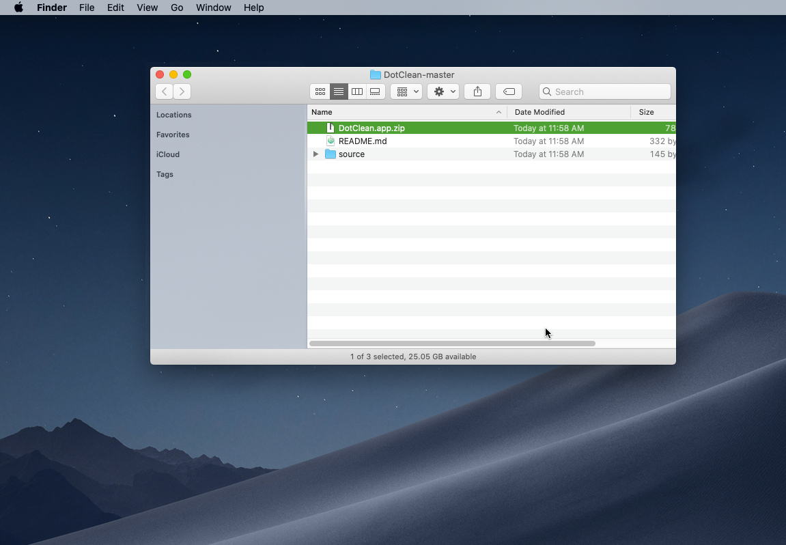

# DotClean

DotClean will remove the ._ (dot underscore) files on macOS using a drag and drop interface.

This is useful for people who are not comfortable using the command line.

These ._ files can cause issues in certain applications, such as when they are present on an SD card for a YX5300 UART Control Serial MP3 Music Player.

---

## Instructions

Download the file, which will be named DotClean-master.zip

Double click on the ZIP file to expand it. You’ll get a folder named DotClean-master.

Inside the DotClean-master folder you’ll see a file named DotClean.app.zip

Double click on the ZIP file to expand it. You’ll get an application named DotClean.

If you try to double click the application to run it, you’ll get a warning dialog. This is due to the application not being registered with Apple. 

It is still safe to use, and we’ve included the source code, which is one line, if you want to inspect it. (It just runs the built-in dot_clean command that Apple provides with the operating system.

Since we cannot double click the application, we’ll have to right click (or control click) and select Open from the contextual menu.

This will open the application, though it may take a few seconds.

Another dialog will be displayed, which allows you to open the application. 

You should only have to do this the first time. Subsequent launches should not require this method.

Now that DotClean has launched, you’ll see a window where you can drop the files & folders onto.

It will clean folders recursively, so just drop the top level folder onto it to clean all files nested within it.

Dropping a folder onto it is pretty uneventful. It will silently clean the folder of _. (dot underscore) files and then just sit there.

You can quit the application when you are done using it.

---

